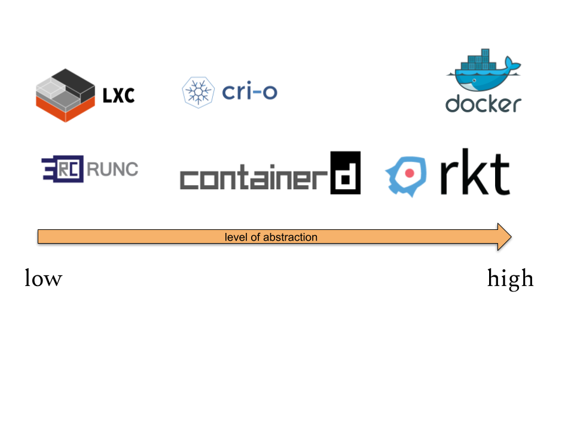
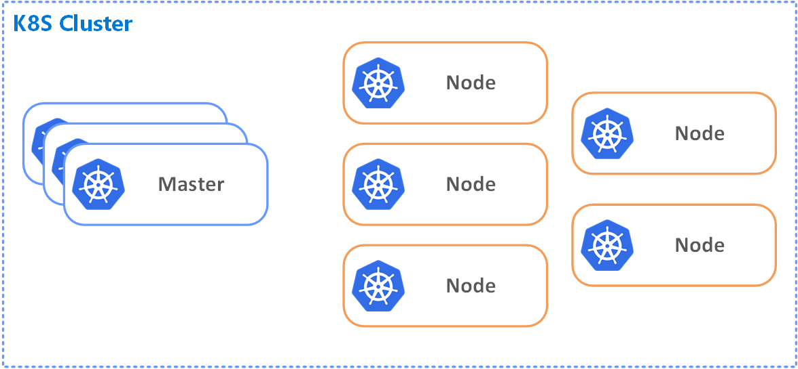

<!-- .slide: data-background="#FB8033" -->
<center>

# What are Containers...?
<div style="width: 75%; height: auto;">
  
</div>

!SUB
# Long definition
  <blockquote>
    “Containers are isolated from one another and bundle their own software, libraries and configuration files; they can communicate with each other through well-defined channels.  All containers are run by a single operating-system kernel and are thus more lightweight than virtual machines.”  
  </blockquote>
  -> <a href=https://en.wikipedia.org/wiki/Docker_(software)>Wikipedia</a>

!SUB
# Short definition
- 1 or more processes isolated from operating system
- contains libraries/files/configs that are necessary for it to work
- runs on operating system, does not care about the hypervisor

!SUB
# Implementation (linux)
- linux namespaces - they let you virtualize system resources
- cgroups - they allow you to limit amount of CPU and RAM consumed

!SUB
# VMs vs Containers
<div class="plain" style="border-top:100px;">
  
</div>

!SUB
# Brief history
<div style="width: 100%; height: auto;">
  
</div>

!SUB
# Container Runtime
Management of resources and additional functionality (image handling, APIs etc.)


!SUB
# Container Images
- Set of layers
- Instance of an image is called container
- Image is a blueprint

Example (docker):

Dockerfile (set of instructions used by docker),
from which image is build may look like that
```
FROM ubuntu:15.04
COPY . /app
RUN make /app
CMD python /app/app.py
```

!SUB
# Layers
<div>

</div>

!SUB
# Container Registry
Single place to manage container images (**library of images**).

Examples:
- [local registry (docker-registry)](https://www.docker.com/blog/how-to-use-your-own-registry/)
- [Docker Hub](https://hub.docker.com/)
- Registries by specific cloud provider:
  - [GCP Container Registry](https://cloud.google.com/container-registry/)
  - [Azure Container Registry](https://azure.microsoft.com/en-us/services/container-registry/)
  - [Amazon Elastic Container Registry](https://aws.amazon.com/ecr/)


!SUB
# Docker hub


!SUB
# Stateful vs Stateless


!SUB
# Persistent storage?
Data stored within writable container layer is **not persistent**.
It is possible to mount external object for the purpose of storing and sharing data between containers.

Example: Most commonly in Docker one would use object called volume.

*Volumes use cases: share data between containers, data stored remotely, backup/restore capability, 
decouple configuration of container host from container runtime*

!SUB
# Container Clusters
Cluster consists of master and worker nodes. 
It is an unit of organisation to make managing objects easier.



!SUB
# Container management software

- [Kubernetes](https://kubernetes.io/)
- [Docker Swarm](https://docs.docker.com/engine/swarm/)
- [Apache Mesos](http://mesos.apache.org/)
- [Openshift](https://www.openshift.com/)
- [Nomad](https://www.nomadproject.io/)
- ...

!SUB
# Why Use Containers?

**Key Reasons**
- [Pets vs Cattle](http://cloudscaling.com/blog/cloud-computing/the-history-of-pets-vs-cattle/)
- Easy way to abstract environment from application
- [Separation of concerns for the teams](https://en.wikipedia.org/wiki/Separation_of_concerns)
- More lightweight than virtual machines (efficiency, time, costs)
- If designed well, can be more secure way of developing apps

!NOTE
- some: notes
- more: notes
