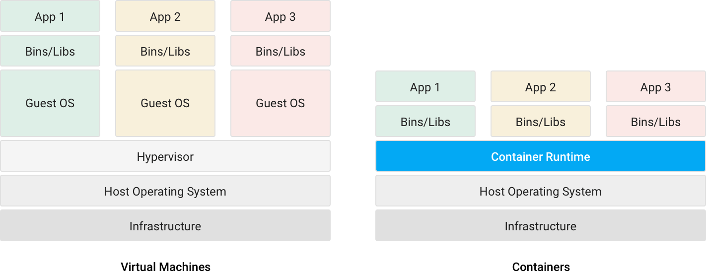
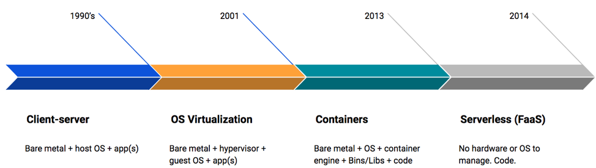

<!-- .slide: data-background="#FB8033" -->

# What are Containers...?

!SUB
# Long definition
  <blockquote>
    “Containers are isolated from one another and bundle their own software, libraries and configuration files; they can communicate with each other through well-defined channels.  All containers are run by a single operating-system kernel and are thus more lightweight than virtual machines.”  
  </blockquote>
  -> <a href=https://en.wikipedia.org/wiki/Docker_(software)>Wikipedia</a>

!SUB
# Short definition
- 1 or more processes isolated from operating system
- contains libraries/files/configs that are necessary for it to work
- runs on operating system, does not care about the hypervisor

!SUB
# Implementation (linux)
- linux namespaces - they let you virtualize system resources
- cgroups - they allow you to limit amount of CPU and RAM consumed

!SUB

  

!SUB
# Brief history

  

!SUB
# Container Runtime
Management of resources and additional functionality (image handling, APIs etc.)

!SUB
# Container Images
About images here

!SUB
# Container Clusters
About clustering here

!SUB
# Technologies around the topic

- Kubernetes
- Docker Swarm
- Apache Mesos
- Openshift
- Nomad
...

!SUB
# Why Use Containers?

**Key Reasons**
- [Pets vs Cattle](http://cloudscaling.com/blog/cloud-computing/the-history-of-pets-vs-cattle/) <!-- .element: class="fragment" -->
- Easy way to abstract environment from application <!-- .element: class="fragment" -->
- Separation of concerns for the teams <!-- .element: class="fragment" -->
- More lightweight than virtual machines (speed, time, costs) <!-- .element: class="fragment" -->
- If designed well, can be more secure way of developing apps  <!-- .element: class="fragment" -->

!NOTE
- some: notes
- more: notes
